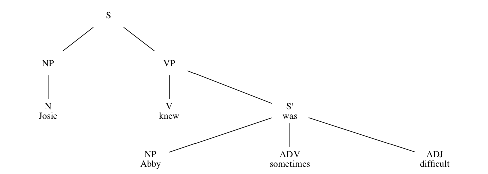

# graphviz-sentence-trees
A meta-language for simplifying the process of making tree diagrams in Graphviz

## How to use

The input file specifies a tree graph in Graphviz using a simplified syntax. This syntax makes it quick and easy to model the tree without having to memorize or lookup the Graphviz syntax.

There are five basic components in the input file:

 1. Entire trees, denoted by a line containing only the word `tree` and no indentation
 2. Nodes, denoted by a label following some level of indentation by tabs.
 3. Annotated nodes, like above with but an annotation following the label after a separator ` - `
 4. Parent-child relationships, denoted by the increase in indentation level from one line to the next
 5. Comment lines, denoted by no indentation and any content other than just `tree`

### Dependencies

The actual parsing of the input file is a Python script, so make sure you have Python 2.7 installed. The output is generated by GraphViz, so make sure you have that as well and can run `dot` from the command line.

If you are on a Mac computer, you can install with the following:
```bash
brew install python graphviz
```

If you are running Linux, you will only likely need to install GraphViz, as Python should be included already.
```bash
apt-get install graphviz
# or
yum install graphviz
# or better yet 😉
emerge graphviz
```

## Example graph

The following is a basic sentence diagram with the parts of speach as nodes and the words of the original sentence as annoted leaf-nodes.

```
Josie knew Abby was sometimes difficult.

tree
	S
		NP
			N - Josie
		VP
			V - knew
			S' - was
				NP - Abby
				ADV - sometimes
				ADJ - difficult	
```

Let's run it with the included run script:

```bash
./makeTree.sh example.tree
```

If that doesn't work, make sure you have all the required dependencies. Now, let's look at our pretty graph!


